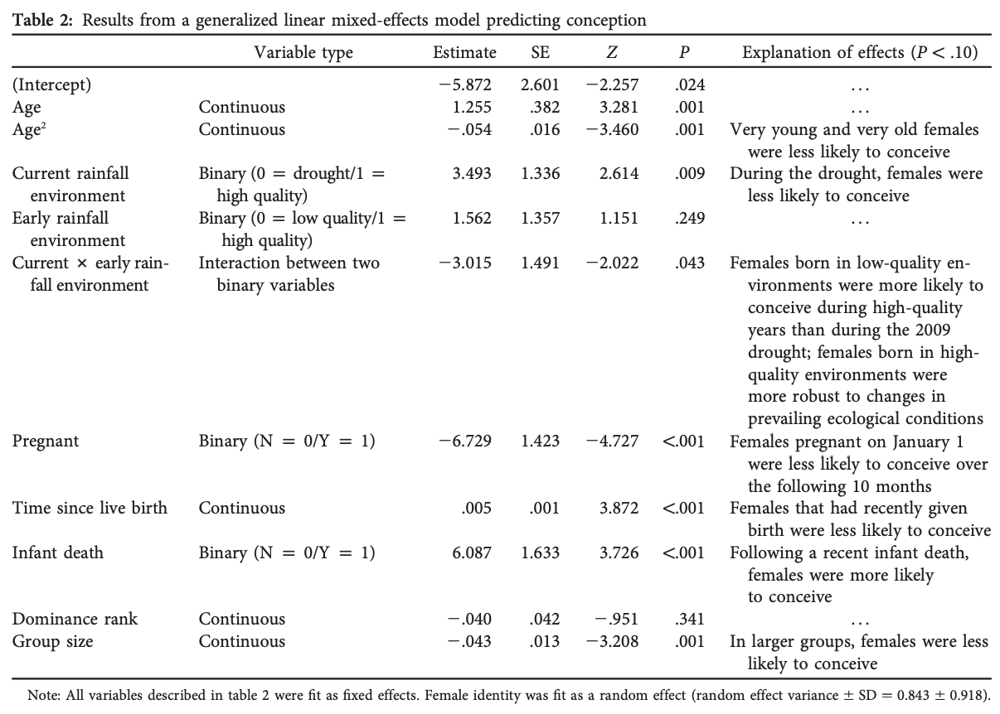
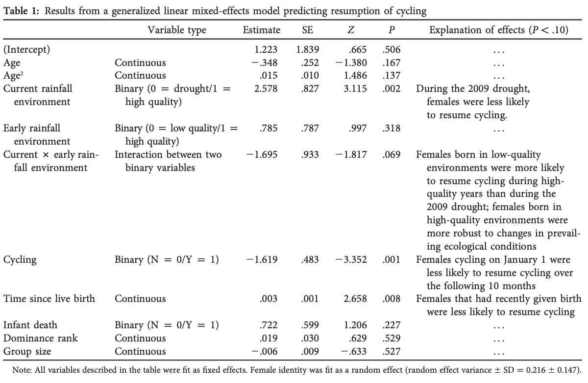

```{r setup, include=FALSE}
knitr::opts_chunk$set(echo = TRUE)
```


## Packages:
The following packages must be installed in order to complete this module:

* {curl}
* {lme4}

## Abstract:
In this study, the authors investigated the ways in which environmental conditions affect development in female baboons (*Papio cynocephalus*). According to the predictive adaptive response hypothesis outlined in the article, environmental challenges during early development should result in adaptive adjustments to prepare the individual for similarly harsh future conditions. In the contending, developmental constraint hypothesis, the cost of early adversity is greater than the potential future benefits. This study aims to determine which of these two hypotheses is supported. To get at this question, they collected long-term data on two sets of female baboons in Amboseli, Kenya. The first set were females born in the dry season when food availability was low. While the other group benefited from being born during productive years when rainfall was above average. For each subject they measured and recorded fertility related variables including: age, rank, group size, time since last birth, whether females were cycling or pregnant, and loss of infant. They then used linear mixed modeling to test the relationship between early environment and the previously mentioned covariates. The findings lend support for the developmental constraint hypothesis as females who faced greater challenges early in life had overall lower reproductive success during drought periods than females born in more prosperous years. They also recognized that the offspring of high ranking females were more resilient to decreases in fertility during droughts, regardless of their early environment.They interpret these findings as suggesting that poor conditions during early development having long term detrimental reproductive ramifications.

## Replication

### Loading in the data
Before we begin we will need to load in our data which was obtained  (https://datadryad.org/stash/dataset/doi:10.5061/dryad.5r37g "HERE").

```{r}
library(curl)
f <- curl("https://raw.githubusercontent.com/cmgagnon/cmgagnon-data-replication-assignment/master/dev_constraints_dryad_dataset.csv")
d <- read.csv(f, header = TRUE, sep = ",", stringsAsFactors = TRUE)
head(d)
summary(d)
str(d) # There are 3 different families, this is probably what we will use for the analysis
d
```

### Data Visualization
```{r}
# first, some exploratory visualization let's plot time since giving birth (days) in relation to subject ID
par(mfrow = c(1, 1))
boxplot(data = d, time_since_birth ~ ID, col = c("lightpink1"))
```
So clearly there is a significant amount of variation in days since giving birth but without accounting for other variables this isn't very helpful.

```{r}
# now let's see how this relates to social rank
par(mfrow = c(1, 1))
boxplot(data = d, time_since_birth ~ rank, col = c("lightpink1"))
```
According to the plot, the lowest ranking individuals seem to have longest inter-birth intervals.

```{r}
# let's plot time since last birth as it relates to early ecology
boxplot(data = d, time_since_birth ~ early_ecology, col = c("burlywood2", 
    "lightpink1"))
```
There does not appear to be a significant difference in mean but its hard to tell.
```{r}
# Finally, let's plot time since last birth and current as it relates to having given birth
boxplot(data = d, time_since_birth ~ early_ecology * conceived, col = c("burlywood2", 
    "lightpink1"))
boxplot(data = d, time_since_birth ~ current_ecology * conceived, col = c("burlywood2", 
    "lightpink1"))
```

```{r}
# let's plot time since last birth and rank as it relates to subject ID
boxplot(data = d, time_since_birth ~ current_ecology * conceived, col = c("burlywood2", 
    "lightpink1"))
```

### Generalized Linear Mixed Modeling

Now let's load the package necessary to conduct our mixed effect modeling.
```{r}
library(lme4)
```

The paper looks independently at two fixed outcomes; the resumption of cycling and whether or not the subject gave birth during the observation period. The methods are sightly vague in regards to their modeling approach but they do list which variables they included. I will play around with a few different models for each of the two outcome variables. 

First, let's do some modeling using the binary "conceived" variable to see if we can replicate their results.


They state in the paper that they used the lmer wrapper function but their table of result say "Results of Generalized Linear Mixed Models" so I think they used the glmer wrapper so thats what I will use. In this model all varialble listed have an additive effect:
```{r}
glme1 <- glmer(data = d, as.numeric(as.factor(d$conceived)) ~ early_ecology + current_ecology + age + rank + grp_size + time_since_birth + infant_death + preg_at_start + (early_ecology * current_ecology) + (1|ID), REML=FALSE)
summary(glme1)
```



After trying several models I still cannot get my numbers to match theirs. MAybe they mess with some parameters that I couldn't figure out. After a little more digging, it looks like I might need to specify the family of error. In the article they say they used a binomial error with a logit link function. Not sure I fully understand what this does but I believe it allows the glmer wrapper to model binary outcomes (i.e. conveived/did not conceive). 

```{r}
glme1a <- glmer(data = d, conceived ~ early_ecology + current_ecology + age + rank + grp_size + time_since_birth + infant_death + preg_at_start + (early_ecology * current_ecology) + (1|ID), family=binomial(link = "logit"))
summary(glme1a)
```
Still does not look right and I am getting errors about eigen values being too high. I believe this means the model is over fitted but I am using the same variable they did. 

Actually, I wasn't! I will add age as a quadratic effect and see if that does the trick.

```{r}
glme1b <- glmer(data = d, conceived ~ early_ecology + current_ecology + age + I(age^2) + rank + grp_size + time_since_birth + infant_death + preg_at_start + (early_ecology * current_ecology) + (1|ID), family=binomial(link = "logit"))
summary(glme1b)
```


I think this may be as close as I am going to get. Everything except the Intercept, Current environment and Early environment do not match. 

Now lets do the same with resumption of cycling as the binary out
```{r}
glme2 <- glmer(data = d, resumed_cycling ~ early_ecology + current_ecology + age + I(age^2) + rank + grp_size + time_since_birth + infant_death + cycling_at_start + (early_ecology * current_ecology) + (1|ID), family=binomial(link = "logit"))
summary(glme2)
```




Got very close with this one as well, but its not an exact replication.

## Discussion

According to my somewhat replicated results, the conclusion put forth by the authors appear reasonable. Individuals subjected to poor quality environments do not appear to out-reproduce others when faced with similar conditions after reaching sexual maturity. Instead, the data supports the developmental constraint hypothesis as female born low quality settings show reduced reproductive success. 